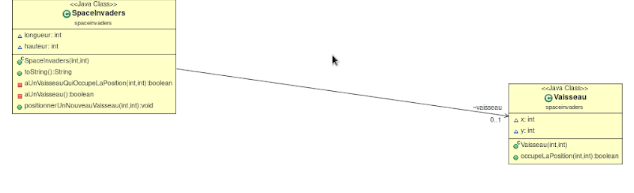
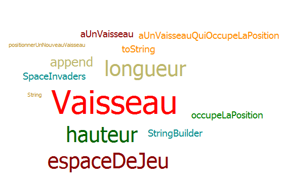
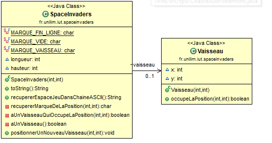
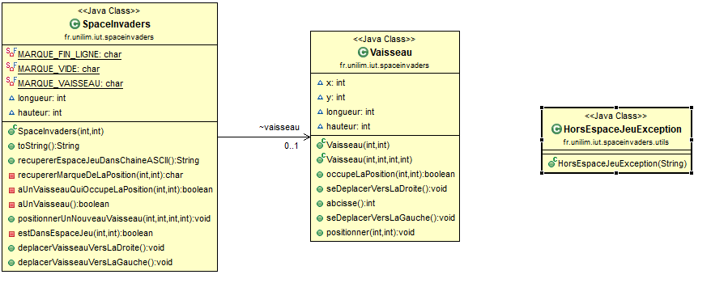
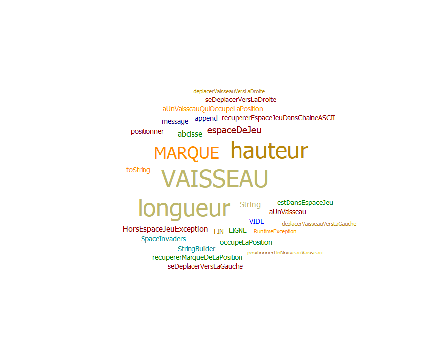
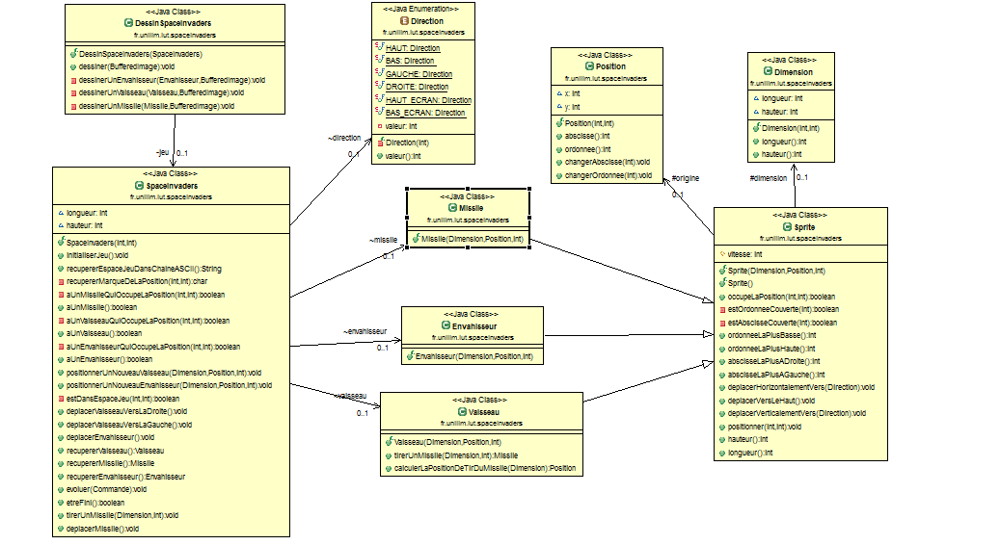
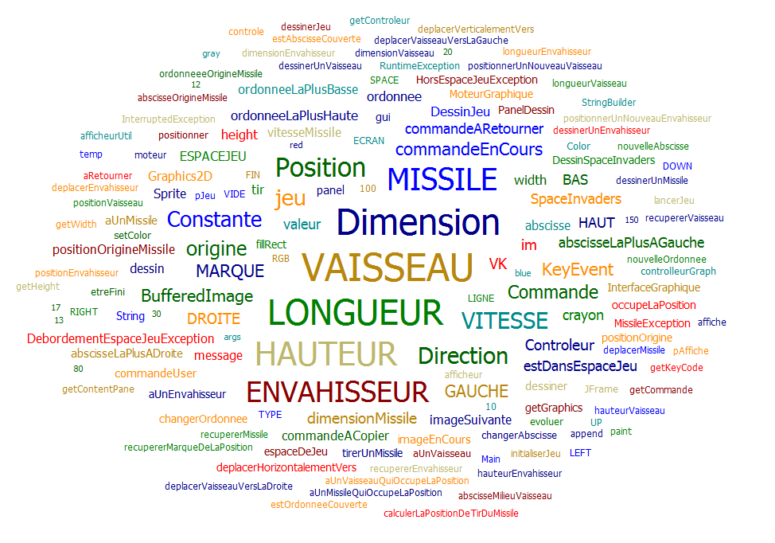
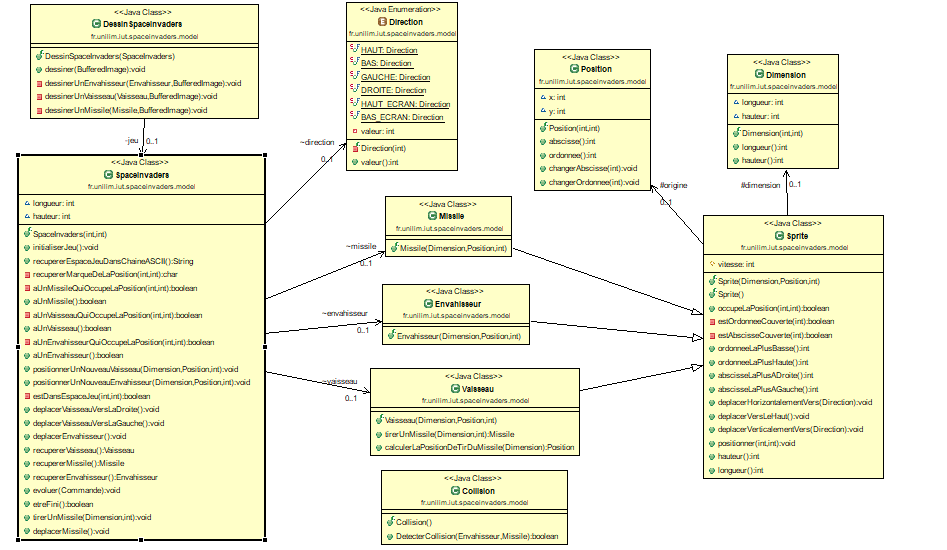
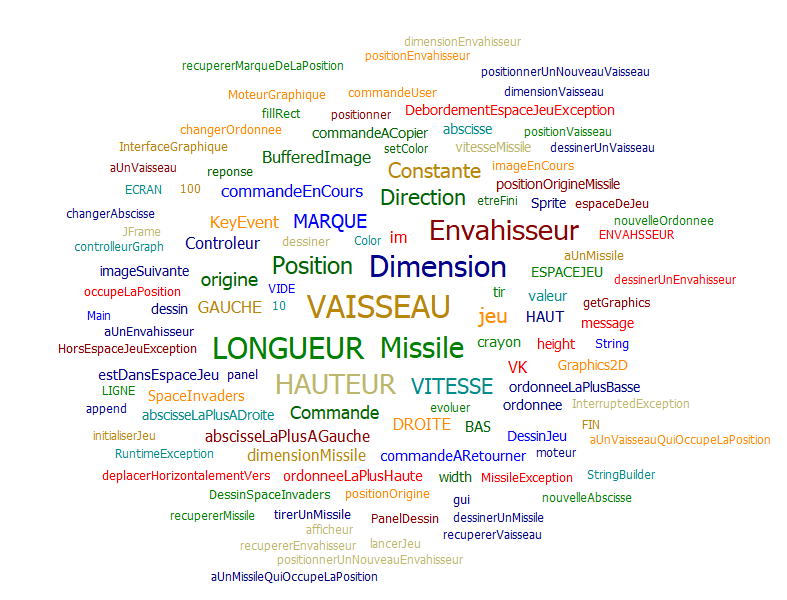

# Semaine du 29 avril au 5 mai

## Description du travail effectué:
Début du travail sur le projet SpaceInvadersS1 avec la création de la classe Vaisseau ainsi que l’initiation au Extract Method afin de rendre notre code plus explicit et plus facile à comprendre.
 
## Diagramme de classes:

## Nuage de mots:

# Semaine du 6 mai au 12 mai

## Description du travail effectué:
 Mise en relation des classes Vaisseau avec l'autre classe et simplification du code toujours dans un but de facilité. Creation de plusieurs methode pour gerer les possibles problemes liés au positionnement afin que le vaisseau ne puisse pas etre positionner en dehors de l'espace de jeu.

## Diagramme de classes:

## Nuage de mots:
![nuage de mots]

# Semaine du 13 mai au 19 mai

## Description du travail effectué:
 j'ai cree la classe Hor Espac Jeu afin de gerer les erreurs en cas de sortie a gauche et a droite de l'espace de jeu. Tout cela en optimisant encore une fois le nom des methodes ainsi que leur details
 

## Diagramme de classes:

## Nuage de mots:

# Semaine du 20 mai au 26 mai

## Description du travail effectué:
 Durant cette semaine, j'ai essayé de rattrapé un peu le retard pris, pour cela j'ai intégré le moteur graphique en creant plusieurs classes pour concevoir l'application. De plus j'ai crée deux classes Missile et Envahisseur le missile etant l'objet lancé par l'envahisseur. Et j'ai fais plusieur tests concernant le Missile et l'Envahisseur.

## Diagramme de classes:

## Nuage de mots:

# Semaine du 27 mai au 2 juin

## Description du travail effectué:
 J'ai corrigé certains test, puis ajouter d'autres pour le missile et la collision. Puis j'ai crée la méthode detecterCollision 

## Diagramme de classes:

## Nuage de mots:
